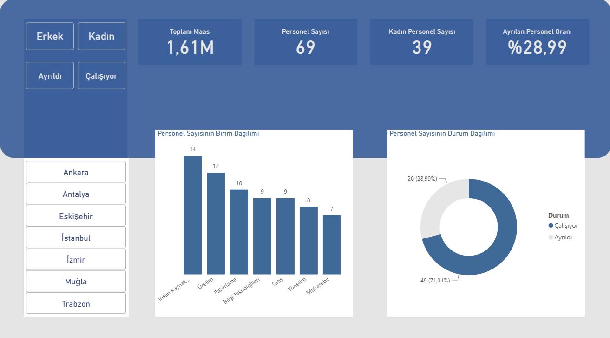

# 📊 HR Analytics Dashboard

> **My first Power BI dashboard project.**  
> This project was created while learning Power BI and represents the beginning of my data analytics journey.

---

## 📌 Project Overview

This dashboard provides an overview of employee data, including workforce distribution, salaries, departments, and employee status.

Although it is my first dashboard, it helped me learn the fundamentals of Power BI, Power Query, and dashboard design. More advanced projects are available in my GitHub portfolio as I continue improving my skills.

---

## 🚀 Dashboard Features

- Total Salary KPI
- Total Employee Count
- Female Employee Count
- Employee Turnover Rate
- Department Distribution
- Employment Status Analysis
- City Filter
- Gender Filter

---

## 🛠 Tools Used

- Power BI
- Power Query
- Basic DAX

---

## 📷 Dashboard Preview

---

## 📚 What I Learned

Through this project I learned:

- Importing and transforming data with Power Query
- Creating KPI cards
- Building interactive dashboards
- Using slicers and filters
- Writing basic DAX measures
- Designing dashboard layouts

---

## 🎯 Note

This dashboard reflects my early stage of learning Power BI.

---

## 👤 Author

Mehmet Ateş

GitHub: https://github.com/mehmetatesbi
